# Roadmap

- Mermaid chart outlining a high-level flow for implementing a Terraform configuration to set up an AWS server with SSH, then using PuTTY for file transfer and test automation:

```mermaid
graph TD
    A[Start] --> B[Install Terraform]
    B --> C[Verify Terraform Installation]
    C --> D[Create symbols Folder]
    D --> E[Configure Terraform in symbols Folder]
    E --> F[Create main.tf File]
    F --> G[Create variables.tf File]
    G --> H[Create terraform.tfvars File]
    H --> I[Add Variables to .gitignore]
    I --> J[Install AWS CLI]
    J --> K[Configure AWS CLI]
    K --> L[Set up AWS Provider in Terraform]
    L --> M[Save AWS Credentials to terraform.tfvars]
    M --> N[Save AWS Key Name to terraform.tfvars]
    N --> O[Define AWS EC2 Instance Resource]
    O --> P[Check if EC2 Instance Resource is Running]
    P --> Q[Specify Instance Type]
    Q --> R[Specify OS]
    R --> S[Specify Region]
    S --> T[Add SSH Key Configuration for Access]
    T --> U[Run Terraform Init]
    U --> V[Run Terraform Plan]
    V --> W[Run Terraform Apply]
    W --> X{AWS EC2 Instance Created?}
    X -->|Yes| Y[Retrieve Public IP of Instance]
    X -->|No| Z[Check Configuration]
    Z --> AA[Check Basic SSH Login]
    AA --> AB[Use ec2-user Instead of root]
    Y --> AC[Install PuTTY on Local Windows Workstation]
    AC --> AD[Generate .ppk Key for PuTTY Authentication]
    AD --> AE[Connect to EC2 via SSH Using PuTTY]
    AE --> AF[Use PuTTY Secure Copy PSCP for File Transfer]
    AF --> AG[Transfer Test Automation Code to EC2]
    AG --> AH[Run Test Automation Code on EC2]
    AH --> AI[Check and Validate Results]
    AI --> AJ[End]

    Z --> D
```

### Explanation of Steps

1. **Install and Configure Terraform**: Set up Terraform locally to manage infrastructure-as-code (IaC).
2. **Create Terraform Configuration**: Define the infrastructure specifications in a `.tf` file.
3. **Set up AWS Provider in Terraform**: Configure AWS provider with access credentials.
4. **Define AWS EC2 Instance Resource**: Specify the instance type, OS, region, etc., in Terraform.
5. **Add SSH Key Configuration for Access**: Define the SSH key pair for EC2 access.
6. **Run Terraform Init and Apply**: Initialize and apply the configuration to create resources.
7. **Retrieve Public IP of Instance**: Get the IP address to access the instance.
8. **Install PuTTY on Local Windows Workstation**: Install PuTTY to use SSH.
9. **Generate .ppk Key for PuTTY Authentication**: Convert the SSH private key to PuTTY's `.ppk` format.
10. **Connect to EC2 via SSH Using PuTTY**: Use PuTTY to SSH into the instance.
11. **Use PuTTY Secure Copy (PSCP) for File Transfer**: Use `pscp` to transfer files to the EC2 instance.
12. **Transfer Test Automation Code to EC2**: Move automation scripts to the instance.
13. **Run Test Automation Code on EC2**: Execute the test automation code on the server.
14. **Check and Validate Results**: Confirm the output of the test automation.
