# Roadmap

- Mermaid chart outlining a high-level flow for implementing a Terraform configuration to set up an AWS server with SSH, then using PuTTY for file transfer and test automation:

```mermaid
graph TD
    A[Start] --> B[Install choco to workstation if not installed and vscode than install terraform from vscode terminal with choco install terraform]
    B --> C[Verify Terraform Installation]
    C --> D[Create symbols Folder]
    D --> E[Configure Terraform in symbols Folder]
    E --> F[Create main.tf File]
    F --> G[Create variables.tf File]
    G --> H[Create terraform.tfvars File]
    H --> I[Add Variables to .gitignore]
    I --> J[Install AWS CLI]
    J --> K[Configure AWS CLI]
    K --> L[Set up AWS Provider in Terraform]
    L --> M[Save AWS Credentials to terraform.tfvars]
    M --> N[Save AWS Key Name to terraform.tfvars]
    N --> O[Define AWS EC2 Instance Resource]
    O --> P[Check if EC2 Instance Resource is Running]
    P --> Q[Specify Instance Type]
    Q --> R[Specify OS]
    R --> S[Specify Region]
    S --> T[Add SSH Key Configuration for Access]
    T --> U[Run Terraform Init enter into the symbols folder]
    U --> V[Run Terraform Plan]
    V --> W[Run Terraform Apply]
    W --> X{AWS EC2 Instance Created?}
    X -->|Yes| Y[Retrieve Public IP of Instance]
    X -->|No| Z[Check Configuration]
    Z --> AA[Check Basic SSH Login]
    AA --> AB[Use ec2-user Instead of root]
    Y --> AC[Install PuTTY on Local Windows Workstation use choco install putty]
    AC --> AD[Generate .ppk Key for PuTTY Authentication]
    AD --> AE[Connect to EC2 via SSH Using PuTTY]
    AE --> AF[Use PuTTY Secure Copy PSCP for File Transfer]
    AF --> AG[Transfer Test Automation Code to EC2]
    AG --> AH[Run Test Automation Code on EC2]
    AH --> AI[Check and Validate Results]
    AI --> AJ[End]

    Z --> D
```

### Explanation of Steps

Here’s a refined version of the setup steps:

1. **Install and Configure Terraform**: Download and set up Terraform on your local machine to manage your infrastructure as code.
2. **Create Terraform Configuration**: Write the infrastructure setup instructions in a `.tf` file to define the desired state.
3. **Set Up AWS Provider in Terraform**: Configure Terraform to interact with AWS by adding your access credentials to the provider block.
4. **Define an AWS EC2 Instance Resource**: Specify the EC2 instance settings like instance type, OS, and region in the configuration file.
5. **Add SSH Key Configuration for Access**: Set up SSH key pairs for secure access to the EC2 instance.
6. **Initialize and Apply Terraform**: Run `terraform init` to initialize, followed by `terraform apply` to deploy the resources.
7. **Retrieve Instance Public IP**: Find the public IP address of the new instance from the Terraform output.
8. **Install PuTTY on Windows (if applicable)**: Download PuTTY to facilitate SSH connections on Windows.
9. **Generate a .ppk Key for PuTTY**: Convert the SSH key to `.ppk` format for PuTTY authentication.
10. **SSH Connect to EC2 Using PuTTY**: Open PuTTY and use the converted key to SSH into the EC2 instance.
11. **Use PuTTY Secure Copy (PSCP) for File Transfer**: Transfer files to and from the EC2 instance with PSCP.
12. **Upload Test Automation Code to EC2**: Transfer your test automation scripts to the instance for execution.
13. **Execute Test Automation Code on EC2**: Run the test automation scripts directly on the server.
14. **Verify Test Results**: Review and validate the results of the test automation execution.

This sequence outlines the main steps for setting up an EC2 instance with Terraform and managing access and automation testing using PuTTY. Let me know if any further customization is needed!

Your project structure looks well-organized, with various directories serving distinct purposes, including:

- **Environments:** Process and type documentation related to key creation and environments.
- **Formulas:** A series of markdown files covering setup, configuration, troubleshooting, and command execution for tools like SSH, Terraform, and AWS.
- **Imaginary:** Visual aids like images and diagrams to assist with key setups, error troubleshooting, and visualizing workflows.
- **Journey:** Documentation on workflows and connectivity, as well as roadmap files for both local environments and CodeSpaces.
- **Real:** Contains OKR (Objectives and Key Results) documentation, likely focusing on actual outcomes or tracking goals.
- **Semblance:** Focuses on error handling and fixes, with both images and markdown files that provide solutions to common issues.
- **Symbols:** Terraform and AWS setup files, keys, and configuration files, along with related binaries and state files.

Each section appears to have specific categories related to DevOps processes, making it easy to locate relevant information or files for development, troubleshooting, or deployment tasks. Let me know if you need help adding more functionality or improving this structure further!

@rifaterdemsahin ➜ /workspaces/Putty (main) $ tree -I 'aws|.terraform'
.
├── Environments
│   ├── ppk-creation-process.md
│   └── types.md
├── Formulas
│   ├── add_ssh_public_key_to_terraform.md
│   ├── aws-cleanup.md
│   ├── aws-client-in-code-spaces.md
│   ├── aws-public-key-upload.md
│   ├── aws-setup.md
│   ├── before-init-makesure-gitignorethere.png
│   ├── copy_public_key_file.md
│   ├── create_ssh_windows_workstation.md
│   ├── debug_connection_issue.md
│   ├── delete-manually-git-cache.md
│   ├── home-folder-pwd.md
│   ├── how_to_use_putty.md
│   ├── howtoexclude.md
│   ├── install-terraform-local.md
│   ├── lfs-fix.md
│   ├── need-for-tfvars-terraform.md
│   ├── provider-to-git-ignore.png
│   ├── providers-cant-be-merged.md
│   ├── public-practical-linux-to-test.md
│   ├── putty-connect.md
│   ├── putty-error-not-taking-in-private-key.md
│   ├── putty-file-copy.md
│   ├── putty_hands_on_implementation.md
│   ├── server-to-connect-create.md
│   ├── server-to-connect.md
│   ├── ssh-connect-username-pass.md
│   ├── ssh-connect.md
│   ├── ssh_connect_with_public_keys.md
│   ├── ssh_keygen_create_copy.md
│   ├── terraform-apply-delete.md
│   ├── terraform-destroy.md
│   ├── terraform-output.md
│   ├── terraform_init-validate-plan.md
│   ├── terraform_init.md
│   ├── terraform_install.md
│   ├── terraform_to_plan.md
│   ├── test-driven-implement.png
│   ├── tree-cant-find-thebig-file.md
│   ├── tree-with-file-sizes.md
│   ├── try-google-toremove-file.md
│   ├── use-tree-exclude-somefiles.md
│   ├── which_key_instheserver.md
│   └── why_use_putty.md
├── Imaginary
│   ├── after-z-aa-mermaid.png
│   ├── archieve-folder-restore-tactic.png
│   ├── aws-cli-ignore.png
│   ├── aws-cli-login-check.png
│   ├── aws-needs-keys-not-infolder-in-aws.png
│   ├── aws_configure-cloudspaces.png
│   ├── aws_configure-forkey-upload.png
│   ├── comment-with-gpt.png
│   ├── cursor-with-ghost-text-help.png
│   ├── faster-ssh-mindset.png
│   ├── fresh_install.png
│   ├── git-ignore-add-ppk-file.png
│   ├── hock-file-togit-ignore.png
│   ├── horizontal-to-vertical-listing.png
│   ├── just-password-authenticate.png
│   ├── keep-adding-steps-tomermarid.png
│   ├── location-fix-saved-the-file.png
│   ├── lock-file-added.png
│   ├── mermaid-extensions.png
│   ├── no-id-second-run-key-delete.png
│   ├── port-22-public-putty-test.png
│   ├── private-keyname-update-touse.png
│   ├── put-the-private-key-to-the-workstation-codespace.png
│   ├── redirect-is-the-issue.png
│   ├── show-status.png
│   ├── ssh-keygen-lastpass.png
│   ├── ssh-server-tobe-installed-at-destination.png
│   ├── ssh_save_location.png
│   ├── succesful-key-import.png
│   ├── terraform-folder-lastpass.png
│   ├── terraform-install .png
│   ├── terraform-no-ami.png
│   ├── tfvar-different-than providertf.png
│   ├── variable-declares-ontop.png
│   ├── visual-steps-to-follow.png
│   └── wim-write-key-from-lastpass.png
├── Journey
│   ├── output-cloudspaces-move-file.md
│   ├── output-codespaces-connect-aws.md
│   ├── output-local-connection.md
│   ├── output-local-with-ssh-key-create.md
│   ├── recurringAndCleanUp.md
│   ├── roadmapCodeSpaces.md
│   └── roadmapLocal.md
├── README.md
├── Real
│   └── okr.md
├── Semblance
│   ├── aws-access-error.md
│   ├── aws-key-import-error.md
│   ├── base64-unknown.md
│   ├── codespaces-no-key-no-connection.md
│   ├── dont-use-root.md
│   ├── dual-provider-error.png
│   ├── explicit-gitignore-added.png
│   ├── filter-branch-failed-it-ortoolong-tocomplete.png
│   ├── fresh_install.png
│   ├── git-cach-from-clean.png
│   ├── git-cache-add.png
│   ├── git-cache-clean-didnot-work.md
│   ├── git-cache-delete.png
│   ├── git-filter-rm.png
│   ├── gitignore-create-gpt.png
│   ├── image-id-error.md
│   ├── keynot-found-error.md
│   ├── last-resort-delete-terrafor].png
│   ├── load-key-invalid-format.md
│   ├── local-pus-error.md
│   ├── multilevelremove.png
│   ├── not-to-push-terraform.png
│   ├── old-token-error.md
│   ├── permission-denied-putty.md
│   ├── permission-denied.md
│   ├── permissions-too-wide-error.md
│   ├── rebooted-git-cantsave-after-filter-rm-remove-.png
│   ├── redirect-is-the-issue.png
│   ├── semblance-github-limits.png
│   ├── semblance_credentials_error.md
│   ├── semblance_install_putty.md
│   ├── semblance_self_Connect_error.md
│   ├── terraform-files-git-error.md
│   ├── terraform-lock-error.md
│   ├── terraform-output-empty.md
│   ├── unable-to-accesskeys.md
│   └── why-does-it-ask-questions-here.md
└── Symbols
    ├── astoryofadevopsengineer.md
    ├── awscliv2.zip
    ├── id_ed25519
    ├── id_ed25519.ppk
    ├── main.tf
    ├── provider.tf
    ├── terraform-aws-ec2
    │   └── terraform_1.0.11_linux_amd64.zip
    ├── terraform.tfstate
    ├── terraform.tfstate.backup
    └── terraform.tfvars

8 directories, 137 files